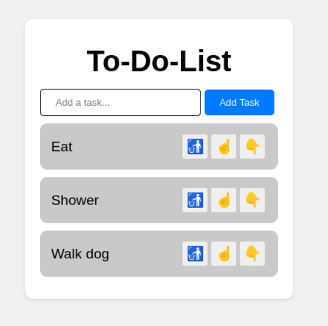

# To-Do List App

A simple, user-friendly To-Do List application built with React. This app allows users to manage their tasks efficiently by adding, deleting, and adding or lowering the priority of tasks.

## Features
* Add Task: Users can add new tasks with a title.
* Delete Task: Users can remove tasks from the list.

## Screenshots


## Technologies Used
* React: JavaScript library for building user interfaces
* CSS: Styling for the user interface
* LocalStorage: To persist task data between page reloads

## Installation
1. Clone the repository
```git clone https://github.com/collins-kimotho/To-Do-List.git ```

2. Navigate to the directory
```cd To-Do-List```

3. Install dependencies
```npm install``

4. Start the development server
```npm run dev```

The app will run on localhost

## Contributing
Contributions, issues, and feature requests are welcome!
Feel free to check the issues page for open issues or submit a pull request.


Contact
For questions or collaboration, contact me at:
Email: [collinskimotho16@gmail.com](collinskimotho16@gmail.com) <br>
GitHub: [collins-kimotho](https://github.com/collins-kimotho/)